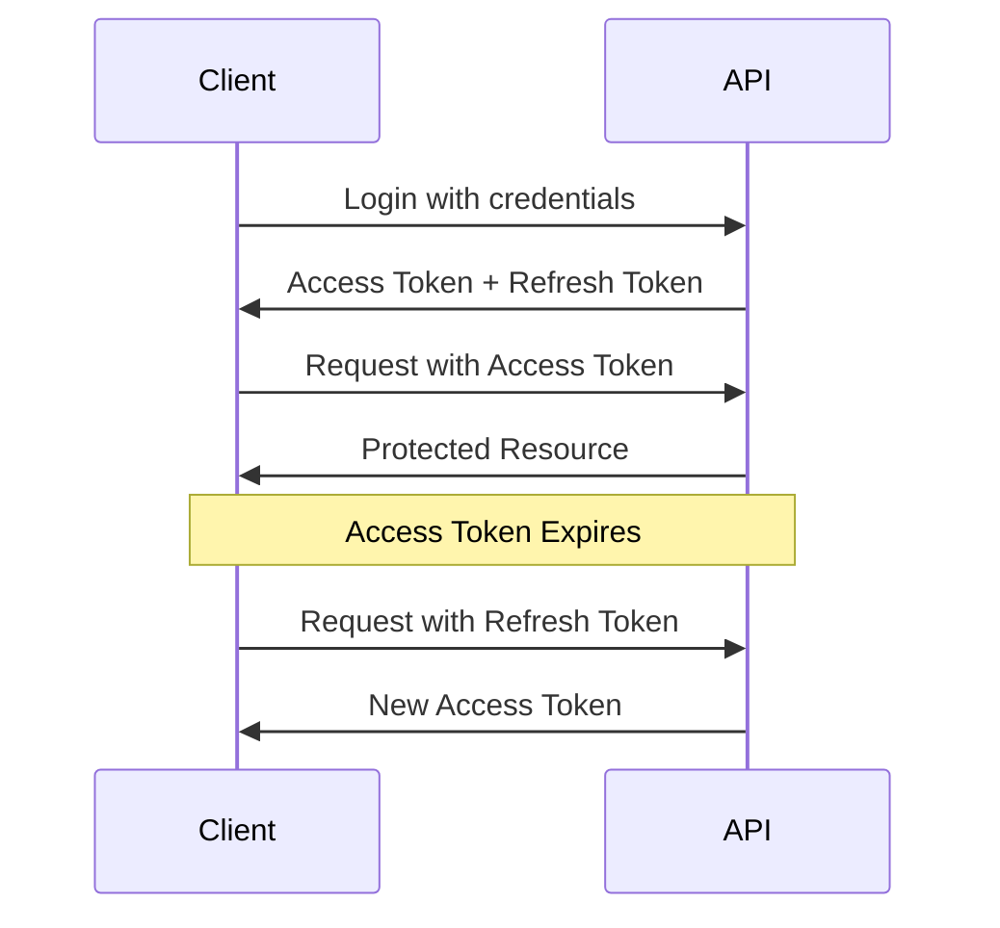

# Security Documentation

Security features and best practices for the Express.js User Management API.

## Security Features

### ✅ Implemented Security Measures

1. **Password Security**

   - bcrypt hashing with configurable salt rounds
   - Minimum password requirements enforced
   - Passwords never stored in plain text
   - Passwords never returned in API responses

2. **JWT Authentication**

   - Secure token-based authentication
   - Separate access and refresh tokens
   - Token expiration times configurable
   - Tokens signed with secret keys

3. **Input Validation & Sanitization**

   - express-validator for all endpoints
   - Email format validation
   - Password strength requirements
   - XSS protection through input sanitization
   - SQL injection protection (when using database)

4. **Role-Based Access Control (RBAC)**

   - Admin-only endpoints protected
   - Role verification middleware
   - Unauthorized access prevention

5. **Token Management**
   - Refresh tokens stored per user
   - Token invalidation on logout
   - Refresh token verification
   - Prevent token reuse after logout

---

## Password Requirements

### Enforced Rules

```javascript
- Minimum length: 8 characters
- Must contain:
  ✓ At least one uppercase letter (A-Z)
  ✓ At least one lowercase letter (a-z)
  ✓ At least one number (0-9)
  ✓ At least one special character (@$!%*?&#)
```

### Example Valid Passwords

```
✅ Password@123
✅ SecureP@ss1
✅ MyStr0ng!Pass
```

### Example Invalid Passwords

```
❌ password123      (no uppercase, no special char)
❌ PASSWORD123      (no lowercase, no special char)
❌ Password         (no number, no special char)
❌ Pass@1           (too short)
```

---

## JWT Token Security

### Access Tokens

- **Purpose**: Authenticate API requests
- **Expiration**: 1 hour (default, configurable)
- **Storage**: Client-side (memory/localStorage)
- **Use**: Include in Authorization header

```
Authorization: Bearer <access_token>
```

### Refresh Tokens

- **Purpose**: Generate new access tokens
- **Expiration**: 7 days (default, configurable)
- **Storage**: Server-side list per user
- **Use**: POST to `/api/users/refresh`

### Token Flow



---

## Environment Variables Security

### Critical Variables

```env
# NEVER commit these to version control!
JWT_SECRET=your_very_long_random_secret_key_here_at_least_32_chars
JWT_REFRESH_SECRET=another_very_long_random_secret_key_here_also_32_chars
```

### Generating Secure Secrets

**Using Node.js:**

```javascript
require("crypto").randomBytes(64).toString("hex");
```

**Using OpenSSL:**

```bash
openssl rand -hex 64
```

**Using Online Tool:**

- https://www.random.org/strings/
- Length: 64 characters
- Character set: Alphanumeric + special chars

### .env File Security

```bash
# Add to .gitignore
.env
.env.local
.env.test
```

---

## Authentication Flow Security

### Registration Security

```javascript
POST /api/users/register

1. Validate input (email format, password strength)
2. Sanitize input (prevent XSS)
3. Check for duplicate email
4. Hash password with bcrypt
5. Create user with hashed password
6. Generate JWT tokens
7. Return user data without password
```

### Login Security

```javascript
POST /api/users/login

1. Validate input
2. Find user by email
3. Compare passwords using bcrypt
4. Generate new JWT tokens
5. Store refresh token with user
6. Return tokens (don't return password)
```

### Token Refresh Security

```javascript
POST /api/users/refresh

1. Validate refresh token format
2. Verify refresh token signature
3. Check if token exists in user's token list
4. Check if token is expired
5. Generate new access token
6. Return new access token only
```

### Logout Security

```javascript
POST /api/users/logout

1. Verify access token
2. Validate refresh token
3. Remove refresh token from user's list
4. Token becomes invalid immediately
```

---

## Input Validation

### express-validator Implementation

```javascript
import { body, validationResult } from "express-validator";

export const validateRegistration = [
  body("email")
    .trim() // Remove whitespace
    .isEmail() // Validate email format
    .withMessage("Invalid email format")
    .normalizeEmail(), // Normalize email

  body("password")
    .isLength({ min: 8 }) // Minimum length
    .withMessage("Password must be at least 8 characters")
    .matches(/[a-z]/) // Lowercase check
    .withMessage("Password must contain lowercase letter")
    .matches(/[A-Z]/) // Uppercase check
    .withMessage("Password must contain uppercase letter")
    .matches(/[0-9]/) // Number check
    .withMessage("Password must contain number")
    .matches(/[@$!%*?&#]/) // Special char check
    .withMessage("Password must contain special character"),

  handleValidationErrors,
];
```

### Custom Validation Helpers

```javascript
import validator from "validator";

// Email validation with sanitization
export const isValidEmail = (email) => {
  if (!email || typeof email !== "string") {
    return { isValid: false, error: "Email is required" };
  }

  const sanitized = validator.trim(email);

  if (!validator.isEmail(sanitized)) {
    return { isValid: false, error: "Invalid email format" };
  }

  return {
    isValid: true,
    sanitized: validator.normalizeEmail(sanitized),
    error: null,
  };
};

// String sanitization (XSS protection)
export const sanitizeString = (input) => {
  if (!input || typeof input !== "string") return "";
  return validator.escape(validator.trim(input));
};
```

---

## Sensitive Data Protection

### Data Sanitization

```javascript
// Remove sensitive fields before sending response
export const sanitizeUser = (user) => {
  const { password, refreshTokens, ...sanitizedUser } = user;
  return sanitizedUser;
};
```

### What Gets Removed

```javascript
// Before sanitization
{
  id: "uuid",
  name: "John Doe",
  email: "john@example.com",
  password: "$2b$10$hashed...",        // ❌ REMOVED
  refreshTokens: ["token1", "token2"], // ❌ REMOVED
  role: "User"
}

// After sanitization
{
  id: "uuid",
  name: "John Doe",
  email: "john@example.com",
  role: "User"
}
```

---

## Error Handling Security

### Don't Expose Sensitive Information

**❌ Bad:**

```javascript
res.status(500).json({
  error: error.stack, // Exposes stack trace
  query: req.query, // Exposes query params
  body: req.body, // Exposes request body
});
```

**✅ Good:**

```javascript
res.status(500).json({
  success: false,
  message: "Internal server error",
  error: process.env.NODE_ENV === "development" ? error.message : {},
});
```

### Consistent Error Messages

**❌ Bad:** (Helps attackers)

```
User not found          // Tells attacker email doesn't exist
Invalid password        // Tells attacker email exists
```

**✅ Good:** (Prevents enumeration)

```
Invalid email or password  // Ambiguous message for both cases
```

---

## HTTPS/TLS

### Production Requirements

```javascript
// Redirect HTTP to HTTPS
app.use((req, res, next) => {
  if (
    req.header("x-forwarded-proto") !== "https" &&
    process.env.NODE_ENV === "production"
  ) {
    res.redirect(`https://${req.header("host")}${req.url}`);
  } else {
    next();
  }
});
```

### Security Headers

```javascript
// Install helmet
npm install helmet

// Use in server.js
import helmet from 'helmet';

app.use(helmet()); // Sets various security headers
```

---

## Rate Limiting

### Implementation (Recommended)

```javascript
// Install express-rate-limit
npm install express-rate-limit

// In server.js or routes
import rateLimit from 'express-rate-limit';

const authLimiter = rateLimit({
  windowMs: 15 * 60 * 1000, // 15 minutes
  max: 5,                   // 5 requests per window
  message: 'Too many attempts, please try again later',
  standardHeaders: true,
  legacyHeaders: false,
});

// Apply to auth routes
router.post('/register', authLimiter, validateRegistration, createUser);
router.post('/login', authLimiter, validateLogin, loginUser);
```

---

## CORS Configuration

### Secure CORS Setup

```javascript
// Install cors
npm install cors

// In server.js
import cors from 'cors';

const corsOptions = {
  origin: process.env.ALLOWED_ORIGINS?.split(',') || 'http://localhost:3000',
  credentials: true,
  optionsSuccessStatus: 200
};

app.use(cors(corsOptions));
```

### .env Configuration

```env
ALLOWED_ORIGINS=https://yourdomain.com,https://www.yourdomain.com
```

---

## Security Checklist

### Pre-Production Checklist

- [ ] **Environment Variables**

  - [ ] Strong JWT secrets (64+ chars)
  - [ ] Secrets not committed to version control
  - [ ] .env files in .gitignore

- [ ] **Authentication**

  - [ ] Password hashing with bcrypt
  - [ ] Strong password requirements
  - [ ] JWT token expiration configured
  - [ ] Refresh token rotation implemented
  - [ ] Logout invalidates tokens

- [ ] **Input Validation**

  - [ ] All inputs validated
  - [ ] Inputs sanitized for XSS
  - [ ] SQL injection protection (if using DB)
  - [ ] File upload validation (if applicable)

- [ ] **HTTPS/TLS**

  - [ ] SSL certificate installed
  - [ ] HTTP redirects to HTTPS
  - [ ] Security headers configured (helmet)

- [ ] **Rate Limiting**

  - [ ] Authentication endpoints rate limited
  - [ ] API endpoints rate limited
  - [ ] DDoS protection configured

- [ ] **Error Handling**

  - [ ] Generic error messages in production
  - [ ] No stack traces exposed
  - [ ] Logging configured properly

- [ ] **Access Control**

  - [ ] RBAC implemented
  - [ ] Admin endpoints protected
  - [ ] CORS configured properly

- [ ] **Database** (when implemented)

  - [ ] Parameterized queries
  - [ ] Connection strings secured
  - [ ] Database user permissions minimal

- [ ] **Monitoring**
  - [ ] Error logging configured
  - [ ] Security event logging
  - [ ] Failed login tracking

---

## Common Vulnerabilities & Prevention

### 1. SQL Injection

**Prevention:**

- Use parameterized queries
- Use ORM (Mongoose, Sequelize)
- Validate and sanitize inputs

### 2. XSS (Cross-Site Scripting)

**Prevention:**

- Use validator.escape()
- Sanitize all user inputs
- Use Content Security Policy headers

### 3. CSRF (Cross-Site Request Forgery)

**Prevention:**

- Use CSRF tokens
- SameSite cookie attribute
- Verify origin headers

### 4. JWT Vulnerabilities

**Prevention:**

- Use strong secrets
- Set expiration times
- Store securely (not localStorage for sensitive apps)
- Invalidate on logout

### 5. Brute Force Attacks

**Prevention:**

- Implement rate limiting
- Account lockout after failed attempts
- CAPTCHA for repeated failures

---

## Security Resources

- [OWASP Top 10](https://owasp.org/www-project-top-ten/)
- [Node.js Security Checklist](https://blog.risingstack.com/node-js-security-checklist/)
- [Express.js Security Best Practices](https://expressjs.com/en/advanced/best-practice-security.html)
- [JWT Best Practices](https://tools.ietf.org/html/rfc8725)

---

## Reporting Security Issues

If you discover a security vulnerability, please email: [your-email@example.com]

**Do not** open a public issue for security vulnerabilities.
