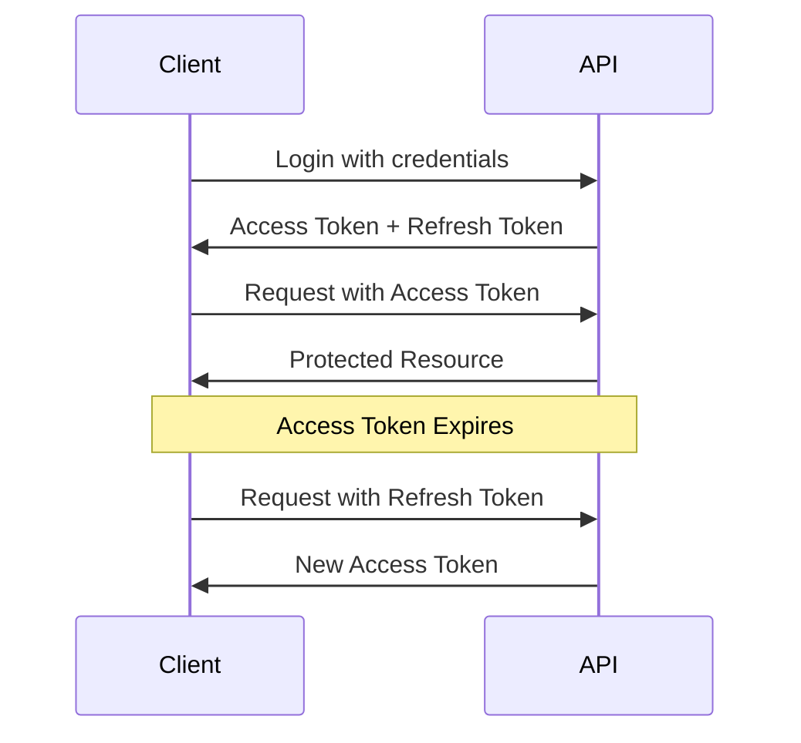
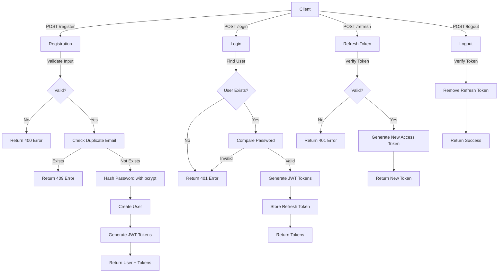
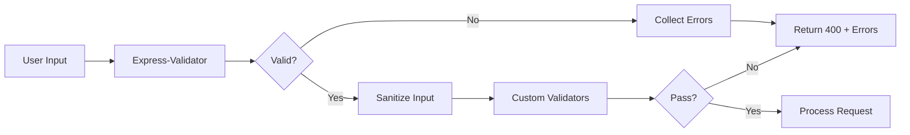
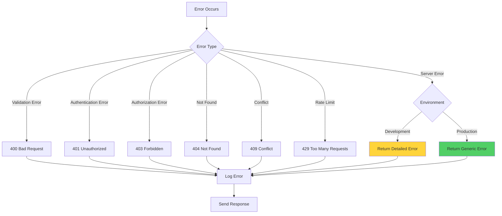
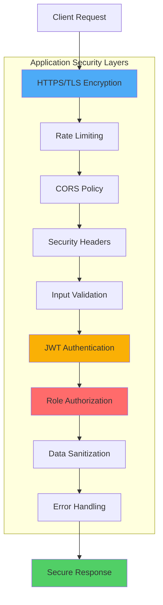
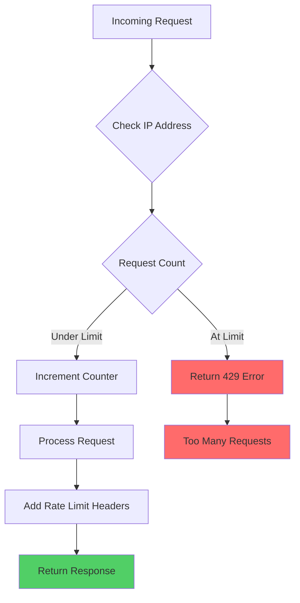

# Security Documentation

Security features and best practices for the Express.js User Management API.

## Security Features

### ✅ Implemented Security Measures

1. **Password Security**

   - bcrypt hashing with configurable salt rounds
   - Minimum password requirements enforced
   - Passwords never stored in plain text
   - Passwords never returned in API responses

2. **JWT Authentication**

   - Secure token-based authentication
   - Separate access and refresh tokens
   - Token expiration times configurable
   - Tokens signed with secret keys

3. **Input Validation & Sanitization**

   - express-validator for all endpoints
   - Email format validation
   - Password strength requirements
   - XSS protection through input sanitization
   - SQL injection protection (when using database)

4. **Role-Based Access Control (RBAC)**

   - Admin-only endpoints protected
   - Role verification middleware
   - Unauthorized access prevention

5. **Token Management**

   - Refresh tokens stored per user
   - Token invalidation on logout
   - Refresh token verification
   - Prevent token reuse after logout

6. **Rate Limiting**
   - Protection against brute force attacks
   - API abuse prevention
   - Configurable limits per endpoint type
   - IP-based request tracking

---

## Password Requirements

### Enforced Rules

```
- Minimum length: 8 characters
- Must contain:
  ✓ At least one uppercase letter (A-Z)
  ✓ At least one lowercase letter (a-z)
  ✓ At least one number (0-9)
```

### Example Valid Passwords

```
✅ Password123
✅ SecurePass1
✅ MyStrong1Pass
✅ TestUser2024
```

### Example Invalid Passwords

```
❌ password123      (no uppercase)
❌ PASSWORD123      (no lowercase)
❌ Password         (no number)
❌ Pass123          (too short)
```

---

## JWT Token Security

### Access Tokens

- **Purpose**: Authenticate API requests
- **Expiration**: 1 hour (default, configurable)
- **Storage**: Client-side (memory/localStorage)
- **Use**: Include in Authorization header

```
Authorization: Bearer <access_token>
```

### Refresh Tokens

- **Purpose**: Generate new access tokens
- **Expiration**: 7 days (default, configurable)
- **Storage**: Server-side list per user
- **Use**: POST to `/api/users/refresh`

### Token Flow



---

## Environment Variables Security

### Critical Variables

```env
# NEVER commit these to version control!
JWT_SECRET=your_very_long_random_secret_key_here_at_least_32_chars
JWT_REFRESH_SECRET=another_very_long_random_secret_key_here_also_32_chars
```

### Generating Secure Secrets

**Using Node.js:**

```javascript
require("crypto").randomBytes(64).toString("hex");
```

**Using OpenSSL:**

```bash
openssl rand -hex 64
```

**Using Online Tool:**

- https://www.random.org/strings/
- Length: 64 characters
- Character set: Alphanumeric + special chars

### .env File Security

```bash
# Add to .gitignore
.env
.env.local
.env.test
```

---

## Authentication Flow Security

### Authentication Flow Security

All authentication operations follow secure practices to protect user credentials and sessions.

**Implementation:** 📄 [User Controller](../controllers/userController.js) | 📄 [Auth Helper](../utils/authHelper.js) | 📄 [JWT Utility](../utils/jwt.js)

**Registration Flow:**

1. Validate and sanitize input
2. Check for duplicate email
3. Hash password with bcrypt
4. Create user with hashed password
5. Generate JWT tokens
6. Return sanitized user data

**Login Flow:**

1. Validate credentials
2. Find user by email
3. Compare password using bcrypt
4. Generate new JWT tokens
5. Store refresh token
6. Return tokens without password

**Token Refresh Flow:**

1. Validate refresh token format
2. Verify token signature
3. Check token exists in user's list
4. Verify token not expired
5. Generate new access token

**Logout Flow:**

1. Verify access token
2. Validate refresh token
3. Remove token from user's list
4. Invalidate session immediately

### Authentication Flow Diagram



---

## Input Validation

### Implementation

The API uses **express-validator** for route-level validation and custom validation helpers for reusable logic.

**Validation Implementation:**

- 📄 [Validation Middleware](../middlewares/validateMiddleware.js) - Express-validator rules and middleware
- 📄 [Validation Helpers](../utils/validationHelper.js) - Custom validation functions

**Key Validation Features:**

- ✅ Email format validation and normalization
- ✅ Password strength validation (8+ chars, uppercase, lowercase, number)
- ✅ Username validation (3-30 chars, alphanumeric with hyphens/underscores)
- ✅ Input sanitization to prevent XSS attacks
- ✅ Detailed error messages for validation failures

### Validation Flow Diagram



---

## Sensitive Data Protection

### Data Sanitization

All user data is sanitized before being sent in API responses to prevent exposure of sensitive information.

**Implementation:** 📄 [Authentication Helper](../utils/authHelper.js)

**Protected Fields:**

- ❌ `password` - Never exposed in responses
- ❌ `refreshTokens` - Kept server-side only
- ✅ `id`, `name`, `email`, `role` - Safe to expose

**Example Response:**

```json
{
  "id": "uuid",
  "name": "John Doe",
  "email": "john@example.com",
  "role": "User"
}
```

---

## Error Handling Security

### Secure Error Responses

The API implements secure error handling to prevent information leakage.

**Implementation:** 📄 [Error Handler](../utils/errorHandler.js) | 📄 [Response Handler](../utils/responseHandler.js)

**Security Principles:**

- ✅ Generic error messages in production
- ✅ Detailed errors only in development mode
- ✅ No stack traces exposed to clients
- ✅ No database query information leaked
- ✅ Consistent error response format

### Error Handling Flow Diagram



### Consistent Error Messages

**❌ Bad:** (Helps attackers)

```
User not found          // Tells attacker email doesn't exist
Invalid password        // Tells attacker email exists
```

**✅ Good:** (Prevents enumeration)

```
Invalid email or password  // Ambiguous message for both cases
```

---

## HTTPS/TLS

### Production Requirements

For production deployment, HTTPS should be enforced to encrypt data in transit.

**Recommended Implementation:**

- Force HTTPS redirect for all HTTP requests
- Use valid SSL/TLS certificates
- Configure security headers with Helmet.js

**Security Headers (Helmet.js):**

- `X-Content-Type-Options: nosniff`
- `X-Frame-Options: DENY`
- `X-XSS-Protection: 1; mode=block`
- `Strict-Transport-Security`

### Security Layers Diagram



---

## Rate Limiting

### ✅ Implemented

The API includes comprehensive rate limiting to prevent abuse and brute force attacks.

#### Configuration

**Environment Variables:**

```env
RATE_LIMIT_WINDOW_MS=900000      # 15 minutes in milliseconds
RATE_LIMIT_MAX_REQUESTS=100      # Max requests per window for general API
AUTH_RATE_LIMIT_MAX=5            # Max requests per window for auth endpoints
```

#### Rate Limit Types

**1. General API Limiter**

- Window: 15 minutes (configurable)
- Max Requests: 100 per window (configurable)
- Scope: All endpoints

**2. Authentication Limiter**

- Window: 15 minutes (configurable)
- Max Requests: 5 per window (configurable)
- Scope: `/login` and `/register`

**3. Account Creation Limiter**

- Window: 1 hour
- Max Requests: 3 per window
- Scope: `/register` only

#### Implementation

**Source Code:** 📄 [Rate Limit Middleware](../middlewares/rateLimitMiddleware.js)

The rate limiting implementation uses `express-rate-limit` package with configurable limits per endpoint type.

### Rate Limiting Flow Diagram



#### Response Headers

When rate limiting is active, the API returns these headers:

```
RateLimit-Limit: 100
RateLimit-Remaining: 99
RateLimit-Reset: 1636723200
```

#### Rate Limit Exceeded Response

**Status Code:** 429 Too Many Requests

```json
{
  "success": false,
  "message": "Too many requests from this IP, please try again later."
}
```

---

## CORS Configuration

Cross-Origin Resource Sharing (CORS) should be properly configured based on your deployment environment.

**Configuration Options:**

- **Development:** Allow localhost origins
- **Production:** Restrict to specific domains via environment variables
- **Credentials:** Enable for authentication with cookies

**Environment Variable:**

```env
ALLOWED_ORIGINS=https://yourdomain.com,https://app.yourdomain.com
```

---

## Security Checklist

### Pre-Production Checklist

- [ ] **Environment Variables**

  - [ ] Strong JWT secrets (64+ chars)
  - [ ] Secrets not committed to version control
  - [ ] .env files in .gitignore

- [ ] **Authentication**

  - [ ] Password hashing with bcrypt
  - [ ] Strong password requirements
  - [ ] JWT token expiration configured
  - [ ] Refresh token rotation implemented
  - [ ] Logout invalidates tokens

- [ ] **Input Validation**

  - [ ] All inputs validated
  - [ ] Inputs sanitized for XSS
  - [ ] SQL injection protection (if using DB)
  - [ ] File upload validation (if applicable)

- [ ] **HTTPS/TLS**

  - [ ] SSL certificate installed
  - [ ] HTTP redirects to HTTPS
  - [ ] Security headers configured (helmet)

- [x] **Rate Limiting**

  - [x] Authentication endpoints rate limited (5 attempts/15 min)
  - [x] API endpoints rate limited (100 requests/15 min)
  - [x] Account creation rate limited (3 accounts/hour)
  - [ ] DDoS protection configured (external service)

- [ ] **Error Handling**

  - [ ] Generic error messages in production
  - [ ] No stack traces exposed
  - [ ] Logging configured properly

- [ ] **Access Control**

  - [ ] RBAC implemented
  - [ ] Admin endpoints protected
  - [ ] CORS configured properly

- [ ] **Database** (when implemented)

  - [ ] Parameterized queries
  - [ ] Connection strings secured
  - [ ] Database user permissions minimal

- [ ] **Monitoring**
  - [ ] Error logging configured
  - [ ] Security event logging
  - [ ] Failed login tracking

---

## Common Vulnerabilities & Prevention

### 1. SQL Injection

**Prevention:**

- Use parameterized queries
- Use ORM (Mongoose, Sequelize)
- Validate and sanitize inputs

### 2. XSS (Cross-Site Scripting)

**Prevention:**

- Use validator.escape()
- Sanitize all user inputs
- Use Content Security Policy headers

### 3. CSRF (Cross-Site Request Forgery)

**Prevention:**

- Use CSRF tokens
- SameSite cookie attribute
- Verify origin headers

### 4. JWT Vulnerabilities

**Prevention:**

- Use strong secrets
- Set expiration times
- Store securely (not localStorage for sensitive apps)
- Invalidate on logout

### 5. Brute Force Attacks

**Prevention:**

- ✅ Rate limiting implemented (5 attempts per 15 minutes)
- ✅ IP-based request tracking
- ⚠️ Account lockout after failed attempts (recommended for production)
- ⚠️ CAPTCHA for repeated failures (recommended for production)

---

## Security Resources

- [OWASP Top 10](https://owasp.org/www-project-top-ten/)
- [Node.js Security Checklist](https://blog.risingstack.com/node-js-security-checklist/)
- [Express.js Security Best Practices](https://expressjs.com/en/advanced/best-practice-security.html)
- [JWT Best Practices](https://tools.ietf.org/html/rfc8725)

---

## Reporting Security Issues

If you discover a security vulnerability, please email: [your-email@example.com]

**Do not** open a public issue for security vulnerabilities.
