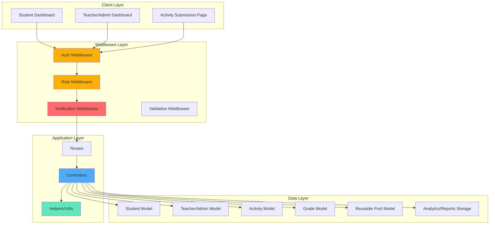
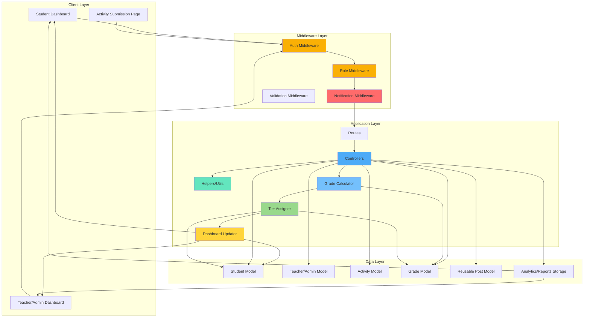

## higher level diagram

```mermaid
flowchart TB
subgraph "Client Layer"
A[Student Dashboard]
B[Teacher/Admin Dashboard]
C[Activity Submission Page]
end

    subgraph "Middleware Layer"
        D[Auth Middleware]
        E[Role Middleware]
        F[Notification Middleware]
        G[Validation Middleware]
    end

    subgraph "Application Layer"
        H[Routes]
        I[Controllers]
        J[Helpers/Utils]
    end

    subgraph "Data Layer"
        K[Student Model]
        L[Teacher/Admin Model]
        M[Activity Model]
        N[Grade Model]
        O[Reusable Post Model]
        P[Analytics/Reports Storage]
    end

    A --> D
    B --> D
    C --> D
    D --> E
    E --> F
    F --> H
    H --> I
    I --> J
    I --> K
    I --> L
    I --> M
    I --> N
    I --> O
    I --> P

    style D fill:#fab005
    style E fill:#fab005
    style F fill:#ff6b6b
    style I fill:#4dabf7
    style J fill:#63e6be
```

```mermaid

flowchart TB
    subgraph "Client Layer"
        A[Student Dashboard]
        B[Teacher/Admin Dashboard]
        C[Activity Submission Page]
    end

    subgraph "Middleware Layer"
        D[Auth Middleware]
        E[Role Middleware]
        F[Notification Middleware]
        G[Validation Middleware]
    end

    subgraph "Application Layer"
        H[Routes]
        I[Controllers]
        J[Helpers/Utils]
        Q[Grade Calculator]
        R[Tier Assigner]
        S[Dashboard Updater]
    end

    subgraph "Data Layer"
        K[Student Model]
        L[Teacher/Admin Model]
        M[Activity Model]
        N[Grade Model]
        O[Reusable Post Model]
        P[Analytics/Reports Storage]
    end

    %% Client to Middleware
    A --> D
    B --> D
    C --> D

    %% Middleware flow
    D --> E
    E --> F
    F --> H
    H --> I
    I --> J

    %% Application logic
    I --> Q
    Q --> R
    R --> S
    S --> K
    S --> B
    S --> A

    %% Data Layer connections
    I --> K
    I --> L
    I --> M
    I --> N
    I --> O
    I --> P
    Q --> N
    R --> N
    R --> K
    P --> B
    P --> A

    %% Styling
    style D fill:#fab005
    style E fill:#fab005
    style F fill:#ff6b6b
    style I fill:#4dabf7
    style J fill:#63e6be
    style Q fill:#74c0fc
    style R fill:#99d98c
    style S fill:#ffd43b

```
