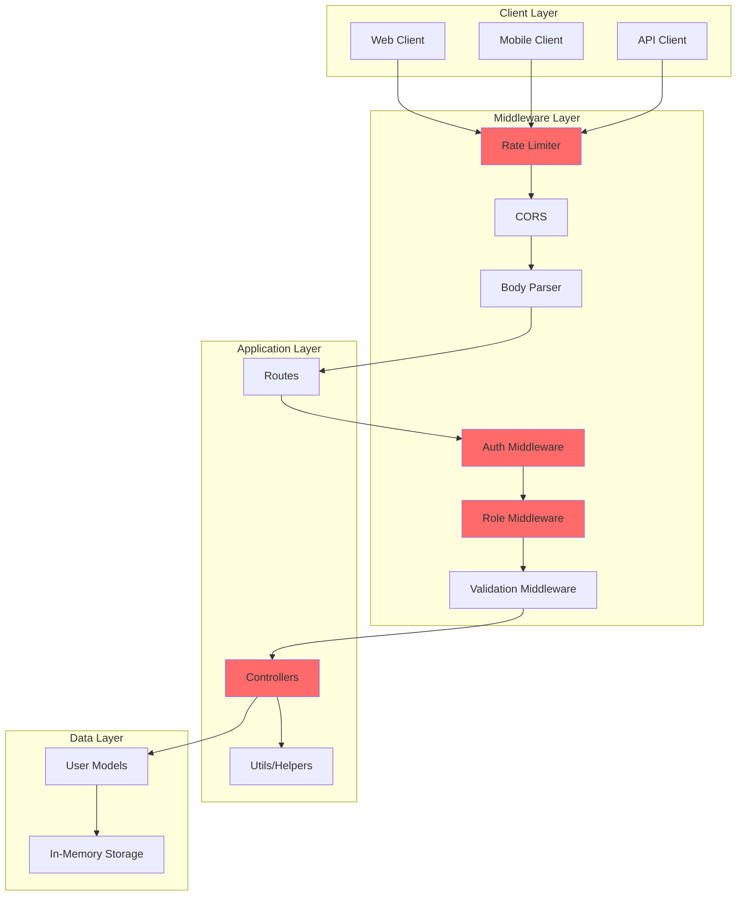
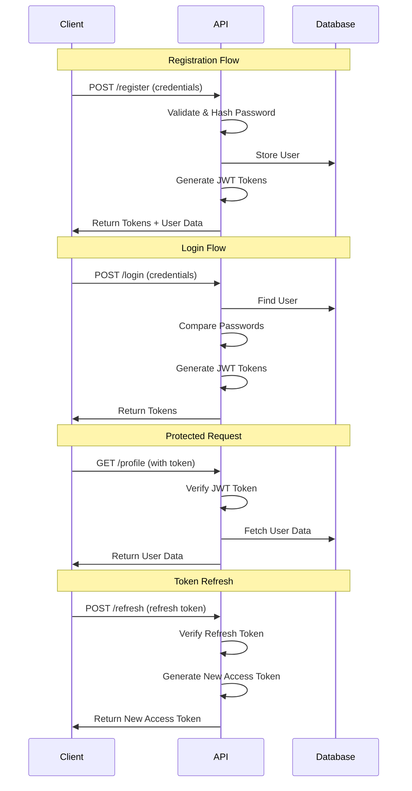

# Express.js User Management API

A RESTful API built with Express.js for user management with JWT authentication, role-based authorization, bcrypt password hashing, rate limiting, and comprehensive testing.

## Features

- ✅ User registration and authentication
- ✅ JWT-based authentication with access and refresh tokens
- ✅ Role-based access control (RBAC)
- ✅ Bcrypt password hashing with salt rounds
- ✅ Token refresh mechanism
- ✅ Secure logout functionality
- ✅ User profile management (get/update)
- ✅ Input validation and sanitization
- ✅ Custom error handling
- ✅ Structured logging
- ✅ Standardized API responses
- ✅ Rate limiting for API protection
- ✅ Comprehensive test coverage (23 tests passing)

## Tech Stack

- **Runtime:** Node.js
- **Framework:** Express.js
- **Authentication:** JWT (jsonwebtoken)
- **Password Hashing:** bcrypt
- **Validation:** express-validator, validator
- **Rate Limiting:** express-rate-limit
- **Testing:** Jest + Supertest
- **Environment:** dotenv
- **Development:** nodemon

## Project Structure

```
express2/
├── .env                          # Environment variables
├── .env.test                     # Test environment variables
├── .gitignore                    # Git ignore file
├── babel.config.cjs              # Babel configuration for Jest
├── package.json                  # Project dependencies
├── server.js                     # Application entry point
├── controllers/
│   └── userController.js         # User business logic
├── middlewares/
│   ├── authMiddleware.js         # JWT authentication middleware
│   ├── roleMiddleware.js         # Role-based authorization middleware
│   ├── validateMiddleware.js     # Input validation middleware
│   └── rateLimitMiddleware.js    # Rate limiting middleware
├── models/
│   └── userModels.js             # User data models
├── routes/
│   └── userRoutes.js             # User route definitions
├── utils/
│   ├── authHelper.js             # Authentication helper functions
│   ├── errorHandler.js           # Error handling utilities
│   ├── jwt.js                    # JWT token generation and verification
│   ├── logger.js                 # Winston logger configuration
│   ├── responseHandler.js        # Standardized response format
│   └── validationHelper.js       # Input validation helpers
├── tests/
│   └── __tests__/
│       ├── auth.test.js          # Authentication endpoint tests
│       ├── profile.test.js       # Profile endpoint tests
│       └── authHelper.test.js    # Helper function unit tests
└── docs/
    ├── API.md                    # Complete API documentation
    ├── TESTING.md                # Testing guide
    └── SECURITY.md               # Security best practices
```

## Prerequisites

- Node.js (v14 or higher)
- npm or yarn

## Installation

1. Clone the repository:

```bash
git clone <repository-url>
cd express2
```

2. Install dependencies:

```bash
npm install
```

3. Create a `.env` file in the root directory:

```env
PORT=3000
JWT_SECRET=your_jwt_secret_key_here_make_it_long_and_random
JWT_EXPIRES_IN=1h
JWT_REFRESH_SECRET=your_jwt_refresh_secret_key_here_also_long_and_random
JWT_REFRESH_EXPIRES_IN=7d
SALT_ROUNDS=10
RATE_LIMIT_WINDOW_MS=900000
RATE_LIMIT_MAX_REQUESTS=100
AUTH_RATE_LIMIT_MAX=5
```

4. Create a `.env.test` file for testing:

```env
NODE_ENV=test
PORT=3001
JWT_SECRET=test_jwt_secret_key_for_testing
JWT_EXPIRES_IN=1h
JWT_REFRESH_SECRET=test_jwt_refresh_secret_key_for_testing
JWT_REFRESH_EXPIRES_IN=7d
SALT_ROUNDS=10
RATE_LIMIT_WINDOW_MS=900000
RATE_LIMIT_MAX_REQUESTS=100
AUTH_RATE_LIMIT_MAX=5
```

## Environment Variables

| Variable                  | Description                          | Default | Required |
| ------------------------- | ------------------------------------ | ------- | -------- |
| `PORT`                    | Server port number                   | 3000    | No       |
| `JWT_SECRET`              | Secret key for JWT signing           | -       | Yes      |
| `JWT_EXPIRES_IN`          | JWT access token expiration time     | 1h      | No       |
| `JWT_REFRESH_SECRET`      | Secret key for refresh token signing | -       | Yes      |
| `JWT_REFRESH_EXPIRES_IN`  | JWT refresh token expiration time    | 7d      | No       |
| `SALT_ROUNDS`             | Bcrypt salt rounds for hashing       | 10      | No       |
| `RATE_LIMIT_WINDOW_MS`    | Rate limit time window in ms         | 900000  | No       |
| `RATE_LIMIT_MAX_REQUESTS` | Max requests per window              | 100     | No       |
| `AUTH_RATE_LIMIT_MAX`     | Max auth attempts per window         | 5       | No       |

## Quick Start

### Running the Application

```bash
# Development mode with auto-reload
npm run dev

# Production mode
npm start

# Run tests
npm test

# Run tests in watch mode
npm run test:watch

# Generate test coverage
npm run test:coverage
```

Server runs on `http://localhost:3000` by default.

## API Endpoints

### Quick Reference

| Method | Endpoint              | Auth Required | Role Required | Description                 |
| ------ | --------------------- | ------------- | ------------- | --------------------------- |
| POST   | `/api/users/register` | No            | -             | Register new user           |
| POST   | `/api/users/login`    | No            | -             | Login user                  |
| POST   | `/api/users/refresh`  | No            | -             | Refresh access token        |
| POST   | `/api/users/logout`   | Yes           | -             | Logout user                 |
| GET    | `/api/users/profile`  | Yes           | -             | Get current user profile    |
| PUT    | `/api/users/profile`  | Yes           | -             | Update current user profile |
| GET    | `/api/users/all`      | Yes           | Admin         | Get all users               |
| GET    | `/api/users/:id`      | Yes           | Admin         | Get user by ID              |

📖 **For detailed API documentation with examples, see [docs/API.md](docs/API.md)**

### API Architecture



## Default Test Users

All users have password: `password123`

| Email             | Role      |
| ----------------- | --------- |
| alice@example.com | Admin     |
| bob@example.com   | User      |
| diana@example.com | Moderator |
| fiona@example.com | Admin     |

## Testing

This project includes comprehensive test coverage with **Jest** and **Supertest**.

### Test Results

```
✅ Test Suites: 3 passed, 3 total
✅ Tests: 23 passed, 23 total
⏱️  Time: ~2.2s
```

### Test Coverage

- **Integration Tests**: Authentication, Profile, Logout flows
- **Unit Tests**: Helper functions (password hashing, sanitization)

📖 **For detailed testing documentation, see [docs/TESTING.md](docs/TESTING.md)**

## Authentication

This API uses JWT (JSON Web Tokens) for authentication:

```
Authorization: Bearer <your_jwt_token>
```

- **Access tokens** expire in 1 hour (configurable)
- **Refresh tokens** expire in 7 days (configurable)
- Tokens are invalidated on logout

### Authentication Flow



🔒 **For security best practices, see [docs/SECURITY.md](docs/SECURITY.md)**

## Documentation

| Document                        | Description                          |
| ------------------------------- | ------------------------------------ |
| [API.md](docs/API.md)           | Complete API reference with examples |
| [TESTING.md](docs/TESTING.md)   | Testing guide and test documentation |
| [SECURITY.md](docs/SECURITY.md) | Security features and best practices |

## Future Enhancements

- [ ] Add database integration (MongoDB/PostgreSQL)
- [x] Implement password authentication with bcrypt
- [x] Add refresh token mechanism
- [x] Add input validation and sanitization
- [x] Add unit and integration tests
- [x] Implement JWT-based authentication
- [x] Add role-based access control
- [x] Implement logout functionality
- [x] Add user profile management
- [ ] Implement password reset functionality
- [ ] Add email verification for new users
- [ ] Add API documentation (Swagger/OpenAPI)
- [x] Implement rate limiting
- [ ] Add pagination for user lists
- [ ] Add file upload for profile pictures

## License

ISC

## Author

Mark Ruzell Maray

---

**Note:** This is a development project. Additional security measures should be implemented before deploying to production.
